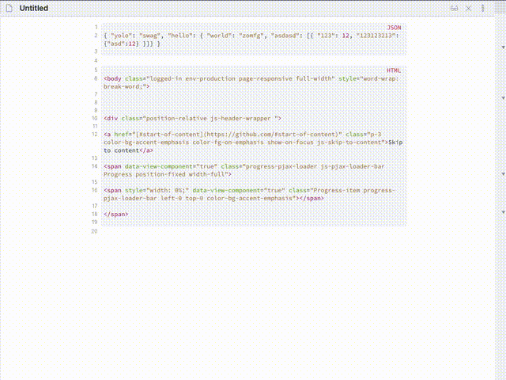

## Obsidian Code Formatter Plugin

This is a plugin for [Obsidian](https://obsidian.md) that introduces
custom commands to format code. Since the orignal plugin Obsidian-Format-Code repository is not being updated/maintained anymore,
this repository is created to keep maintaining and building on top of this plugin.

Currently supports the following languages:
- JSON
- YAML
- HTML
- GraphQL
- TypeScript

[Prettier](https://github.com/prettier/prettier) is used under the hood.

### How to use

### How to install

Until this plugin is not published in the Obsidian ecosystem you 
can install it using [How to develop](#how-to-develop) instructions

### How to develop

1. Clone the repository to `.obsidian/plugins/obsidian-format-code`
2. `npm i`
3. `npm run dev`
4. Launch Obsidian
5. Enable plugin in the Obsidian settings under "Community plugins" > "Installed plugins"" >"Format code"
